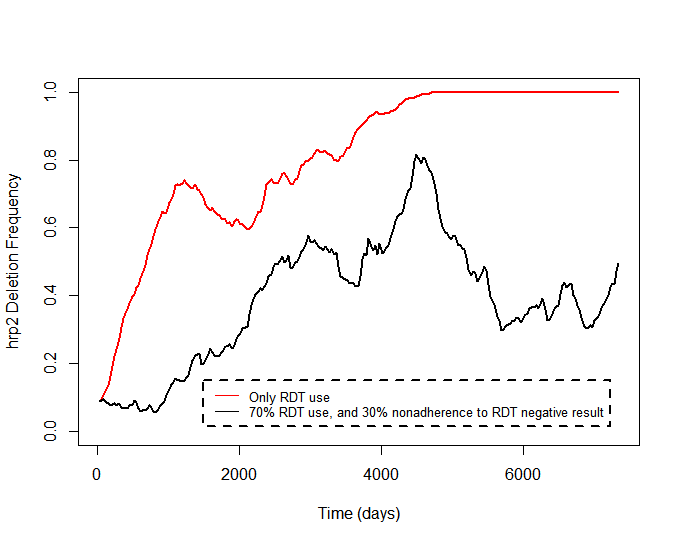

# hrp2malaRia

*Individual Malaria modelling*

Installing *hrp2malaRia* devel
-------------
To install the development version from github (the package *devtools is required*):

```r
library(devtools)
install_github("OJWatson/hrp2malaRia")
```

Once installed, the package can be loaded using:

```r
library(hrp2malaRia)
```

Asking a question
------------------
- for bug reports, feature requests, contributions, use github's [issue system](https://github.com/OJWatson/hrp2_malaRia/issues)

## Demonstration

We can demonstrate this by simulating 2 populations of 2000 individuals. Each 
population starts with 10% frequencey of hrp2 deletions. One population only
uses RDTs, whereas the other uses 70% RDTs, as well as not adhering to a
negative RDT result and still treating patients. Both populations have an 
annual EIR of 1. 

```r

# population 1
r <- hrp2_Simulation(N=2000, years=20, rdt.det = 0, EIR=1/365)

# population 2
r2 <- hrp2_Simulation(N=2000,years=20,rdt.det = .3,microscopy.use = .3)

# and let's plot these - all veriables that begin with S. are series variables collected over time. 

# let's plot the first population
plot(r$S.Times,r$S.N.Dels, xlab = "Time (days)", ylab = "hrp2 Deletion Frequency", ylim=c(0,1), col="red", type="l", lwd=2)

# and add the second population
lines(r2$S.Times,r2$S.N.Dels,lwd=2)

# and add our legend
legend(1500, .15, legend=c("Only RDT use", "70% RDT use, and 30% nonadherence to RDT negative result"),
col=c("red", "black"), lty=1, cex=0.8,
box.lty=2, box.lwd=2)
```
